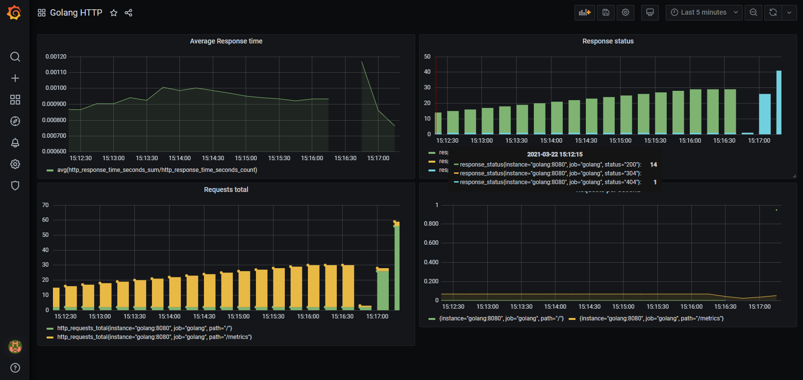

# Example Go app that exposes Prometheus metrics

[](https://goreportcard.com/report/github.com/kostis-codefresh/prometheus-sample-app)



Original code modified from https://gabrieltanner.org/blog/collecting-prometheus-metrics-in-golang


## How to build

Run:

 *  `go build` to get the executable OR
 *  `docker build . -t example-app` to create a container image if you prefer docker instead or don't have access to a Go dev environment

## How to run the application on its own

 * `go run .` OR
 * `docker run -p 8080:8080 example-app`

 Then visit http://localhost:8080 or http://localhost:8080/metrics

 ## How to run with Prometheus and Graphana

 Run `docker-compose up`

 You can access Prometheus at http://localhost:9090 and Graphana at http://localhost:3000

1. Login into Graphana. Default user/password for Graphana is admin/admin
1. Add a datasource for type Prometheus at address http://go-monitoring-prometheus-graphana-prometheus-1:9090 
1. Import [graphana/graphana-dashboard.json](graphana/graphana-dashboard.json) as a premade dashboard

## Run on k8s (kind)

```
k3d cluster create sre
kubectl create namespace monitoring
helm repo add prometheus-community https://prometheus-community.github.io/helm-charts
helm install prometheus-operator prometheus-community/kube-prometheus-stack -n monitoring
kubectl --namespace monitoring get pods
kubectl port-forward svc/prometheus-operator-kube-p-prometheus -n monitoring 9090:9090
kubectl port-forward svc/prometheus-operator-grafana -n monitoring 3000:80
kubectl get secret -n monitoring  prometheus-operator-grafana -o jsonpath="{.data.admin-password}" | base64 --decode ; echo
prom-operator
docker build -t davarski/go-mon:latest .
docker login 
docker push davarski/go-mon:latest
cd k8s-manigest
kubectl apply -f deployment.yaml -f servcie.yaml 
kubectl apply -f -f servicemonitor.yaml -n monitoring
kubectl port-forward svc/go-mon 8080:8080
curl http://localhost:8080/metrics
kubectl get servicemonitors -n monitoring
```
